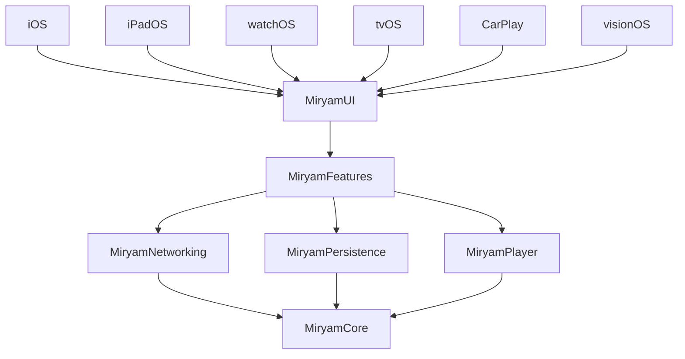

# Miryam

[](https://github.com/RafaelPlantard/Miryam/actions/workflows/ci.yml)
[](https://codecov.io/gh/RafaelPlantard/Miryam)
[](https://github.com/RafaelPlantard/Miryam/tags)

> Named after Miriam (Miryam) — Moses' sister, prophet, and musician who played the timbrel and led song after the crossing of the Red Sea (Exodus 15:20-21).
> The challenge is for [Moises.ai](https://moises.ai); Miryam is who stands next to Moses and makes music.

A multi-platform Apple music search app built as a code challenge for Moises.ai. Search the iTunes catalog, play song previews, browse albums, and keep track of recently played songs — all with offline-first caching.

## Getting Started

**Prerequisites:** [Homebrew](https://brew.sh)

```bash
brew install just       # one-time: install the task runner
just bootstrap          # installs everything else, generates project, opens Xcode
```

`bootstrap` auto-detects and installs missing tools (rbenv, Mint, Ruby, SwiftLint, SwiftFormat, XcodeGen) — just confirm with Enter.

## Platforms

iPhone · iPad · Apple Watch · Apple TV · CarPlay · visionOS

## Compatibility

| Platform | Minimum Version |
| -------- | --------------- |
| iOS      | 17.0            |
| watchOS  | 10.0            |
| tvOS     | 17.0            |
| visionOS | 1.0             |
| macOS    | 14.0            |

## Architecture



**Dependency rule:** ViewModels depend only on protocols in MiryamCore. Concrete implementations are injected via `DependencyContainer`. No ViewModel imports Networking or Persistence directly.

## Features

- **Song Search** — Real-time search with 300ms debounce, pagination, pull-to-refresh
- **Audio Playback** — 30-second iTunes previews with play/pause, skip forward/backward, drag-to-seek timeline
- **Album View** — Browse all tracks in an album, tap to play
- **Recently Played** — Persisted via SwiftData, shown on home screen
- **Offline-First** — Search results cached; falls back to cache on network errors
- **Dark & Light Mode** — Semantic color tokens adapt automatically
- **iPad Responsive** — Adaptive artwork sizing and spacing for larger displays
- **Apple Watch** — Now playing controls on watchOS
- **Apple TV** — Full-screen experience with focus-based navigation
- **CarPlay** — Now playing template for in-car audio control
- **Accessibility** — WCAG AA contrast, VoiceOver labels, 44pt tap targets, Dynamic Type

## Tech Stack


| Category         | Technology                                     |
| ---------------- | ---------------------------------------------- |
| Language         | Swift 6 (strict concurrency)                   |
| IDE              | Xcode 26.4                                     |
| Apple SDKs       | 26.4 (iOS, watchOS, tvOS, visionOS, macOS)     |
| UI               | SwiftUI                                        |
| Architecture     | MVVM (enforced by SPM package graph)           |
| State            | `@Observable`, `@MainActor` ViewModels, actors |
| Persistence      | SwiftData                                      |
| Networking       | URLSession, iTunes Search API                  |
| Audio            | AVFoundation                                   |
| Navigation       | NavigationStack + typed `AppRoute` enum        |
| Font             | DM Sans (Google Fonts)                         |
| Snapshot Testing | swift-snapshot-testing (Point-Free)            |
| Testing          | Swift Testing, XCUITest                        |
| Tooling          | XcodeGen, Mint, Fastlane, Just                 |
| CI/CD            | GitHub Actions                                 |


## Testing

Unit tests, snapshot tests, and UI tests across all packages:


| Suite             | Tests | Description                                 |
| ----------------- | ----- | ------------------------------------------- |
| MiryamTests       | 5     | Domain model integration tests              |
| MiryamUITests     | 8     | XCUITest search, playback, navigation flows |
| Snapshot — iPhone | 28    | All screens x dark/light x states           |
| Snapshot — iPad   | 14    | All screens x dark/light + landscape        |
| Snapshot — Watch  | 4     | Now playing x dark/light x states           |
| Snapshot — TV     | 13    | All screens x dark/light x states           |


```bash
just test    # run all tests
just lint    # SwiftLint + SwiftFormat check
```

## Project Structure

```
Miryam/
  Miryam/                    # iOS app target (MiryamApp.swift, CarPlay, Assets)
  MiryamWatch/               # watchOS app target
  MiryamTV/                  # tvOS app target
  MiryamVision/              # visionOS app target
  MiryamTests/               # Integration tests
  MiryamUITests/             # XCUITests
  Packages/
    MiryamCore/              # Domain models, protocols, errors
    MiryamNetworking/        # iTunes API client, DTOs
    MiryamPersistence/       # SwiftData cache, offline-first
    MiryamPlayer/            # AVFoundation audio player
    MiryamFeatures/          # ViewModels, Router, DI container
    MiryamUI/                # Design system, views, components, snapshot tests
  project.yml                # XcodeGen project definition
  justfile                   # Task runner
  fastlane/                  # Automation lanes
  .github/workflows/         # CI/CD pipelines
```

## Challenge Spec

See [CHALLENGE.md](CHALLENGE.md) for the original code challenge specification.