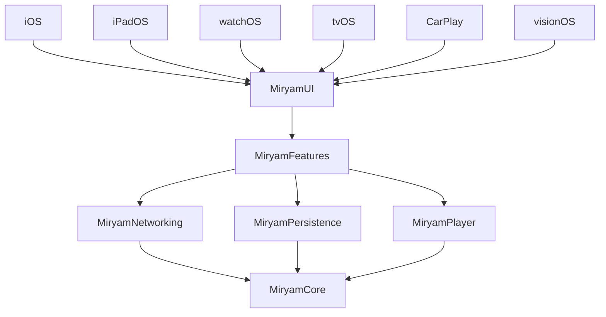

# Miryam

[](https://github.com/RafaelPlantard/Miryam/actions/workflows/ci.yml)
[](https://app.codecov.io/github/RafaelPlantard/Miryam)
[](https://github.com/RafaelPlantard/Miryam/tags)

> Named after Miriam (Miryam) — Moses' sister, prophet, and musician who played the timbrel and led song after the crossing of the Red Sea (Exodus 15:20-21).
> The challenge is for [Moises.ai](https://moises.ai); Miryam is who stands next to Moses and makes music.

A SwiftUI music search app built as a code challenge for Moises.ai, centered on the required iPhone/iPad flow: search the iTunes catalog, play song previews, browse albums, and keep track of recently played songs with offline-first caching. watchOS, tvOS, CarPlay, and visionOS are additive extensions of the same package architecture, not the primary review target.

## Getting Started

**Prerequisites:** [Homebrew](https://brew.sh)

```bash
brew install just       # one-time: install the task runner
just bootstrap          # installs everything else, generates project, opens Xcode
```

`bootstrap` auto-detects and installs missing tools (rbenv, Mint, Ruby, SwiftLint, SwiftFormat, XcodeGen) — just confirm with Enter.

Validated on Xcode 26.4, using the simulator set bundled with that toolchain for local checks and CI.

## Reviewer Fast Path

- Review the required 5-surface iPhone/iPad challenge flow from [CHALLENGE.md](CHALLENGE.md) first.
- Use [docs/challenge-audit.md](docs/challenge-audit.md) for a requirement-to-code map of every must-have.
- Treat watchOS, tvOS, CarPlay, and visionOS as additive architecture proofs rather than the main evaluation surface.
- CI intentionally uses self-hosted macOS runners for the full Apple simulator matrix and auto-installs any missing host tools needed by the workflows.

## Platforms

iPhone · iPad · Apple Watch · Apple TV · CarPlay · visionOS

## Compatibility

| Platform | Minimum Version |
| -------- | --------------- |
| iOS      | 17.0            |
| watchOS  | 10.0            |
| tvOS     | 17.0            |
| visionOS | 1.0             |
| macOS    | 14.0            |

## Architecture



**Dependency rule:** ViewModels depend only on protocols in MiryamCore. Concrete implementations are injected via `DependencyContainer`. No ViewModel imports Networking or Persistence directly.

## Features

### Challenge Scope

- **Song Search** — Real-time search with 300ms debounce, pagination, pull-to-refresh
- **Audio Playback** — 30-second iTunes previews with play/pause, skip forward/backward, drag-to-seek timeline
- **Album View** — Browse all tracks in an album, tap to play
- **Recently Played** — Persisted via SwiftData, shown on home screen
- **Offline-First** — Search results cached; falls back to cache on network errors
- **iPad Responsive** — Adaptive artwork sizing and spacing for larger displays
- **Accessibility** — WCAG AA contrast, VoiceOver labels, 44pt tap targets, Dynamic Type

### Additive Platforms And Polish

- **Dark & Light Mode** — Semantic color tokens adapt automatically
- **Apple Watch** — Now playing controls on watchOS
- **Apple TV** — Full-screen experience with focus-based navigation
- **CarPlay** — Now playing template for in-car audio control

## Tech Stack


| Category         | Technology                                     |
| ---------------- | ---------------------------------------------- |
| Language         | Swift 6 (strict concurrency)                   |
| IDE              | Xcode 26.4                                     |
| UI               | SwiftUI                                        |
| Architecture     | MVVM (enforced by SPM package graph)           |
| State            | `@Observable`, `@MainActor` ViewModels, actors |
| Persistence      | SwiftData                                      |
| Networking       | URLSession, iTunes Search API                  |
| Audio            | AVFoundation                                   |
| Navigation       | NavigationStack + typed `AppRoute` enum        |
| Font             | DM Sans (Google Fonts)                         |
| Snapshot Testing | swift-snapshot-testing (Point-Free)            |
| Testing          | Swift Testing, XCTest, XCUITest                |
| Tooling          | XcodeGen, Mint, Fastlane, Just                 |
| CI/CD            | GitHub Actions                                 |


## Testing

The test strategy is split into explicit lanes so the pyramid stays focused on unit and snapshot coverage, with only the smallest necessary XCUITest surface area.


| Lane          | Local Entry Points                                                                 | Responsibility                                        |
| ------------- | ---------------------------------------------------------------------------------- | ---------------------------------------------------- |
| Unit          | `MiryamAppUnitTests`, `MiryamWatchUnitTests`, `MiryamVisionUnitTests`, `swift test --package-path Packages/MiryamCore`, `Packages/MiryamNetworking`, `Packages/MiryamPersistence`, `Packages/MiryamPlayer`, `Packages/MiryamFeatures` | Logic, repositories, state machines, view models, watchOS smoke coverage, visionOS smoke coverage |
| Snapshot      | `MiryamSnapshotTests`, `MiryamTVSnapshotTests`                                     | Visual regressions, layout states, screen fidelity   |
| Accessibility | `MiryamAccessibilityXCUITests`                                                     | Runtime accessibility audits and app accessibility    |
| UI Smoke      | `MiryamSmokeXCUITests`                                                             | Minimal end-to-end launch, player, and album flows   |


```bash
just test           # run every lane in order
just test-unit      # iOS + watchOS + visionOS app unit suites + package tests
just test-snapshots # iOS + tvOS snapshot suites
just test-a11y      # runtime accessibility audits
just test-ui-smoke  # minimal end-to-end XCUI flows
just snapshot-update # re-record iOS + tvOS reference images
just lint           # SwiftLint + SwiftFormat check
```

`AllTests` is available as a shared Xcode scheme for app-owned test targets. For the full cross-platform run, `just test` remains the authoritative local entry point.

CI runs the same gated lane sequence after `lint`, then publishes reporting per lane to Codecov. `Unit Tests` uploads normalized Cobertura coverage for iOS, watchOS, and visionOS app targets plus normalized SwiftPM LCOV coverage and JUnit/xUnit reports, `Snapshot Tests` uploads normalized iOS and tvOS Cobertura coverage plus JUnit reports, and the `Accessibility` and `UI Smoke` lanes upload normalized coverage derived from their `.xcresult` bundles along with JUnit analytics.

Raw `.xcresult` bundles remain attached to each GitHub Actions run as artifacts for debugging, alongside the generated JUnit and normalized coverage exports. Local `just test*` commands mirror the lane structure, but report generation and Codecov uploads remain CI-only.

## Project Structure

```
Miryam/
  Miryam/                    # iOS app target (MiryamApp.swift, CarPlay, Assets)
  MiryamWatch/               # watchOS app target
  MiryamTV/                  # tvOS app target
  MiryamVision/              # visionOS app target
  MiryamTests/               # App-owned unit tests
  MiryamWatchTests/          # watchOS unit smoke tests
  MiryamVisionTests/         # visionOS unit smoke tests
  MiryamSmokeXCUITests/      # Minimal smoke XCUITests
  MiryamAccessibilityXCUITests/ # Runtime accessibility XCUITests
  Packages/
    MiryamCore/              # Domain models, protocols, errors
    MiryamNetworking/        # iTunes API client, DTOs
    MiryamPersistence/       # SwiftData cache, offline-first
    MiryamPlayer/            # AVFoundation audio player
    MiryamFeatures/          # ViewModels, Router, DI container
    MiryamUI/                # Design system, views, components
  project.yml                # XcodeGen project definition
  justfile                   # Task runner
  fastlane/                  # Automation lanes
  .github/workflows/         # CI/CD pipelines
```

## Challenge Spec

See [CHALLENGE.md](CHALLENGE.md) for the original code challenge specification.

For the fastest reviewer path through the required scope, see [docs/challenge-audit.md](docs/challenge-audit.md).
That audit maps each must-have requirement to its implementation and highlights which extra platform surfaces are additive rather than challenge-critical.
